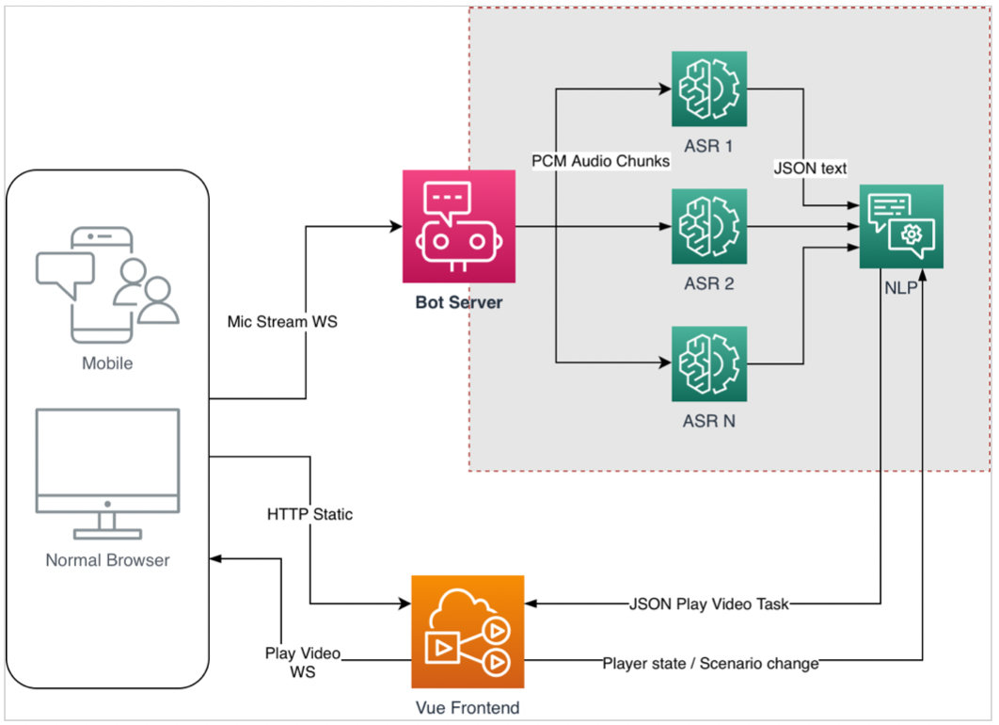

# Задание Golang Апрель 2023 
### Вступление
Разработка интерактивного ассистента для веб-сайта является сложной задачей, требующей глубоких знаний в области фронтенд и бэкенд разработки. Для успешной реализации проекта необходимо обладать навыками работы с различными технологиями и инструментами.

Для работы с интерактивным ассистентом потребуются знания в области аудио и видео потоков, API и брокеров сообщений. Кроме того, важно иметь понимание принципов работы асинхронности, технологий синхронизации многопоточных приложений и безопасности данных.
### Описание
Интерактивный ассистент на веб-сайте позволяет принимать голосовые команды в реальном времени и отвечать на них в формате проигрывания пред-записанного видеоролика в проигрывателе Vue Frontend. Настройки сценариев работы ассистента хранятся в YAML-файлах. Кроме того, пользователь может выбрать желаемый сценарий на Vue Frontend.

На схеме представлено взаимодействие всех сервисов голосового ассистента, в текущем задании рассматриваются вопросы связанные только с сервисами бэкенда (Bot Server).

Компоненты ASR, NLP используемые в рамках бэкенда уже существуют, описание взаимодействия представлено ниже.

### Детали
1. Обмен данными между Vue Frontend и Bot Server осуществляется по NATS (NATS WS) Предусмотрены следующие subjects для обмена данными:
- player.input для отправки заданий на проигрывание видео
- player.output возврат статусов проигрывателя
- ui.output пользователь изменил сценарий - тело сообщения в формате JSON
2. ASR - распознавание речи, представляет собой одно-поточное изолированное linux приложение, запуск с использованием os.exec [https://pkg.go.dev/os/exec] взаимодействие через pipes:
- stdin непрерывная отправка PCM аудио фрагментов заданной длинны (80 миллисекунд).
- stdout получение ответа в JSON после обработки значимого количества аудио фрагментов.
- stderr получение ошибок.
  Если требуется одновременно распознавать 10 потоков, нужно запустить 10 ASR приложений.
  Загрузка одного экземпляра ASR приложения в RAM занимает продолжительное время, поэтому, после завершения работы над очередной задачей, процесс ASR не должен прерываться, а ожидать следующей работы.
3. NLP - представляет собой уже существующие пакеты на Go, позволяющие проводить манипуляции с текстом: нормализировать текст, находить ключевые слова, осуществлять поиск на соответствие в справочниках, преобразование цифр в нужный формат.